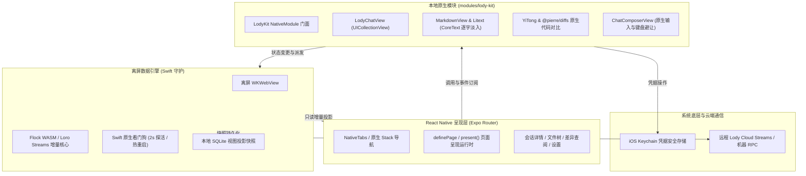

<div align="center">
  
  <h1>Lody iOS</h1>
  <p><b>独立的 iOS 原生体验客户端</b> · 专为移动端打造的 AI 协作与会话伴侣</p>

  <p>
    
    
    
    
    
  </p>
</div>


---

## 概述

**Lody iOS** 是专为 iPhone 打造的独立开源客户端，通过轻量安全的方式连接远程 Lody 服务与本地工作区。

本项目采用 **React Native + 深度定制 Swift 原生模块（LodyKit）** 的混合架构，在保留跨平台声明式 UI 高效迭代优势的同时，关键交互（聊天长列表、流式文字渲染、代码差异高亮、文件树等）均使用原生 Swift 与 CoreText 深度打磨，提供极致纯正的 iOS 系统质感。

---

## 特性一览

### 极致的 Apple HIG 原生体验

- **遵循人机交互界面指南**：全面适配 iOS 系统语义色彩、自适应浅深色模式、SF Pro / SF Mono 动态字号（Dynamic Type）。
- **原生导航交互**：采用 Expo Router 原生 Stack 与 NativeTabs，支持原生软滚边（soft scroll edge effects）、交互式侧滑返回手势，以及 UIKit 原生分组列表（`UICollectionViewListCell`）。

### 高性能原生流式聊天

- **虚拟化长列表**：聊天视图由 Swift 原生 `UICollectionView` 支撑，即便面对超长消息历史依然保持满帧流畅。
- **CoreText Markdown 渲染**：深度集成 [MarkdownView](https://github.com/Lakr233/MarkdownView) 与 [Litext](https://github.com/Lakr233/Litext)，原生支持复杂表格、语法高亮代码块、任务列表、LaTeX 数学公式与系统级选词手柄。
- **逐字流式平滑淡入**：结合均匀分批调度算法与底层 `CTRunDraw` 字符透明度过渡，让 AI 思考输出过程平滑柔和、不突兀、不闪烁。
- **原生输入控件 `ChatComposerView`**：与系统输入法软键盘像素级贴合避让，支持输入草稿本地持久化自动恢复，以及模型思考强度（Thinking Effort）实时调节。

### 代码 Diff 与项目文件浏览

- **代码变更一览**：每轮对话活动自动汇总文件变更，支持一键进入整轮变更文件列表（Turn Changes）。
- **词级差异高亮**：借助 [YiTong](https://github.com/onevcat/YiTong) 封装并在本地无感渲染 [@pierre/diffs](https://github.com/pierrecomputer/pierre/tree/main/packages/diffs)，提供精准的行内对比、语法高亮与虚拟化快速滚动。
- **远程工作区文件树**：随时查阅远程 Mac / 服务器上的项目目录与文件，支持通过原生代码视图 `LodyCodeView` 或系统 QuickLook 预览。

### 离屏 WASM CRDT 数据同步引擎

- **无感 CRDT 协同**：在 Swift 托管的离屏 `WKWebView` 中运行官方 Loro / Flock CRDT 增量同步核心与 Streams 客户端，彻底规避传统 React Native 打包 Node/CRDT/Zstd 底层依赖的兼容问题。
- **看门狗保障（Watchdog）**：Swift 原生探活机制保障后台任务稳定运行，发生异常时支持无感热恢复。
- **多会话后台增量**：本地 SQLite 展示快照保障首屏毫秒级加载，后台自动维持最近活跃会话的实时双向增量同步。

### 安全优先与硬件隔离

- **标准设备流认证**：使用官方 Better Auth Device Flow 授权机制。
- **系统级 Keychain 托管**：所有认证凭据与敏感通信密钥严格隔离保存在 iOS Keychain 中，不暴露在应用公共存储中。

---

## 架构设计



---

## 目录结构

```text
lody-ios/
├── apps/
│   └── mobile/
│       ├── src/
│       │   ├── app/                 # Expo Router 路由与 Stack 声明
│       │   ├── presentation/        # definePage / present() 页面呈现机制
│       │   ├── features/            # 业务页面 (sessions, changes, files, settings)
│       │   ├── theme/               # Apple HIG 语义化设计令牌
│       │   └── ui/                  # 共享 React Native 基础组件
│       ├── modules/
│       │   └── lody-kit/            # 第一方本地原生 Swift 模块 (LodyKit)
│       │       ├── ios/             # Swift / UIKit / CoreText 原生代码
│       │       ├── data-runtime/    # 离屏数据运行时 RPC 与适配脚本
│       │       └── src/             # 面向 React Native 的类型化原生组件入口
│       ├── plugins/                 # 本地 Expo 编译插件 (如 cocoapods-spm 配置)
│       └── package.json
├── docs/                            # 架构设计、演进文档与规格说明
├── package.json                     # Monorepo 根配置
└── pnpm-workspace.yaml
```

---

## 开发与构建

### 前置环境要求

- **macOS**：推荐 Sequoia 或更高版本
- **Xcode**：16.0+（安装 Command Line Tools）
- **Node.js**：`>= 22.13`
- **pnpm**：`11.10.0`
- **Ruby & Bundler**：系统自带或 Homebrew Ruby（推荐安装 `cocoapods` 和 `cocoapods-spm`）

### 快速开始

1. **克隆项目并安装依赖**：

   ```sh
   git clone https://github.com/Innei/lody-ios.git
   cd lody-ios
   pnpm install
   ```

2. **生成原生工程并启动模拟器**：

   ```sh
   pnpm ios
   ```

   > [!TIP]
   > 本项目通过 `cocoapods-spm` 引入 SPM 静态库依赖。`pnpm ios` 内部会自动生成工程并调用 `bundle exec pod install` 完成依赖拉取与符号挂载。
   > 若已完成原生编译，后续仅修改 JavaScript 代码时直接运行 `pnpm start` 即可连接热重载服务。

3. **原生资产更新**：

   若修改了 `modules/lody-kit/data-runtime/` 中的运行时资源，可单独执行：

   ```sh
   pnpm --filter @lody-ios/mobile native:assets
   ```

### 质量检查与测试

```sh
pnpm check      # 执行 TypeScript 类型检查与 Prettier 风格校验
pnpm test       # 执行端到端会话逻辑测试 (基于 Node.js 22 内置测试执行器)
pnpm bundle     # 验证 iOS Hermes JavaScript 生产包打包完整性
```

---

## 致谢

Lody iOS 的实现离不开以下优秀的开源项目与创作者的支持：

- **[FlowDown](https://github.com/Lakr233/FlowDown)**：感谢 [Lakr233](https://github.com/Lakr233) 及其贡献者。Lody 的原生消息长列表、流式分批机制及动态测量缓存体系汲取了其架构灵感。
- **[MarkdownView](https://github.com/Lakr233/MarkdownView) & [Litext](https://github.com/Lakr233/Litext)**：为本项目带来了兼具极致性能与高扩展度的 CoreText Markdown 渲染与文本排版能力。
- **[YiTong](https://github.com/onevcat/YiTong)**：感谢 [onevcat](https://github.com/onevcat) 的优秀封装，使优雅高效的原生代码差异渲染在 iOS 上成为可能。
- **[@pierre/diffs](https://github.com/pierrecomputer/pierre/tree/main/packages/diffs)**：提供了出色的词级高亮差异算法与现代化 Web diff 体验。
- **[Loro](https://github.com/loro-dev/loro)**：高效稳定的下一代 CRDT 状态协调技术。
